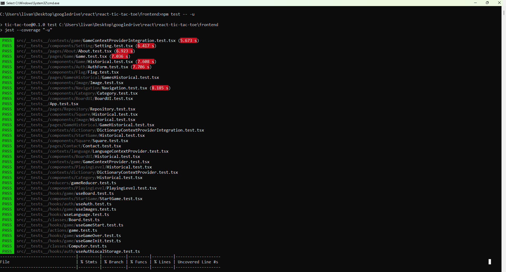
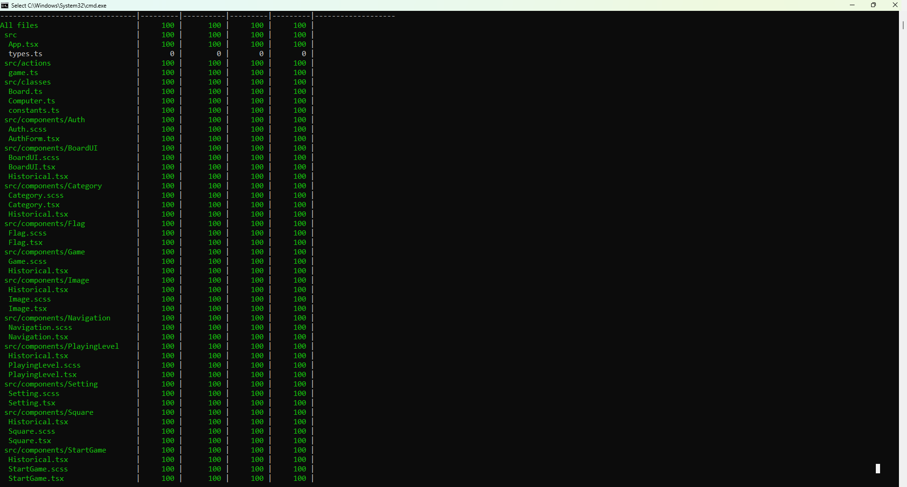
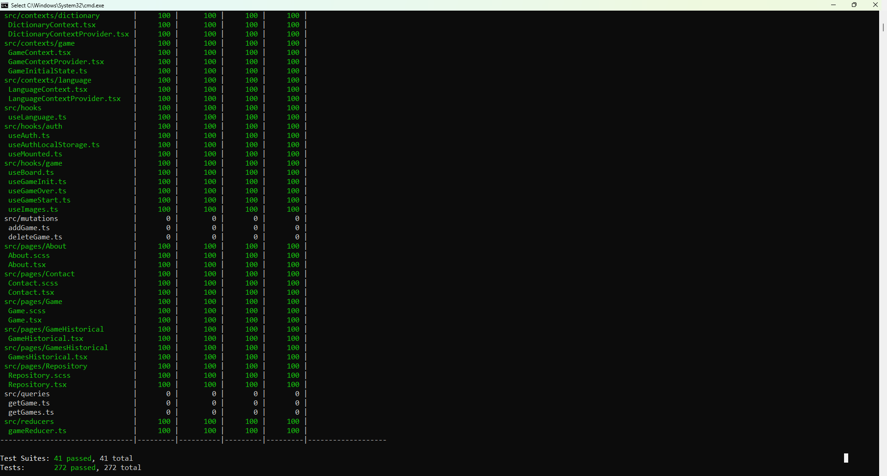
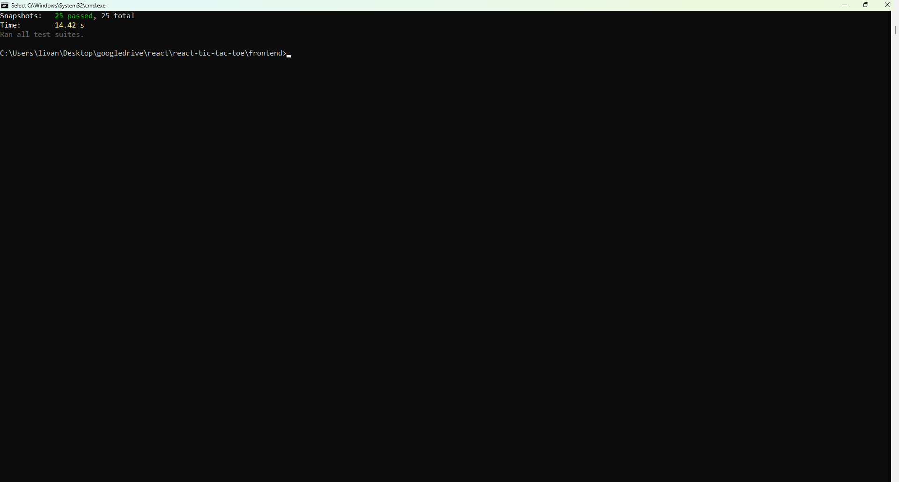
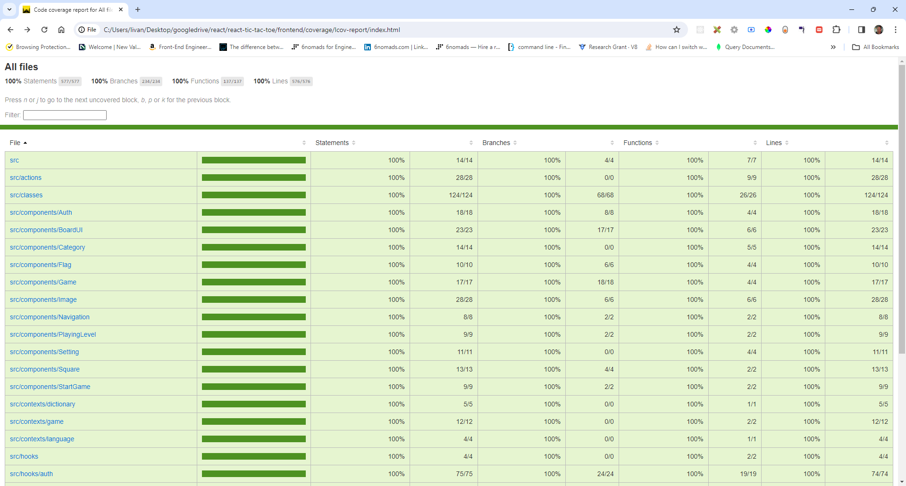
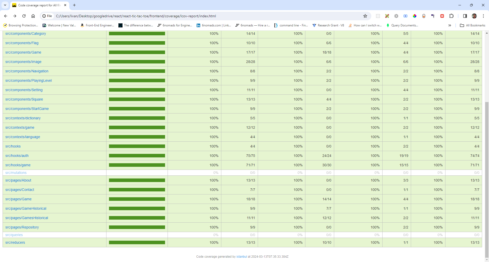

A Tic-tac-toe game based on images from different categories where your opponent is always the computer. Built with Node.js, Express.js, MongoDB, Mongoose, REST-API, GraphQL, Apollo Server, Apollo Client, TypeScript, React.js, React Hooks, React Context, HTML5 , CSS3 and Sass. Unit tests created with Jest and React Testing Library.

Node.js: v14.16.0

